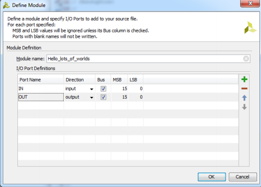

# Digital Lab 3 Daybook_module2(20190917)

## Location: TLD

## Aim

1. Consolidate the process of creating a project that we learn in Module 1
2. Know the concept of bus and use it to control 16 LEDs

## Preview about today's task (The concept of BUS)

**Bus:** A collection of wires. It is often used in defining large interconnections in the project.

The notation is simple as below

```verilog
wire[7:0] wirename
```


## In the lab:

## Module 1 Hello Many World

### **Step 1: Create a new project**

The difference from the previous module is that we need to set input and output as bus and define the bits of it.



Then in the source code file enter the code below:

```verilog
assign OUT = IN;
```

### **Step2: Synthesis:**

Synthesis can only run on the top source file. Therefore, set the source file as the top by right click and set as top. After fun the synthesis, we can see the RTL and Technology schematics.

### **Step3: create constrains file**

Just like previous module, we need to use constrains file to connect the input and output signal to the pins

```verilog
//Switches
set_property PACKAGE_PIN V17 [get_ports {IN[0]}]
set_property IONSTADARD LVCMOS33 [get_ports {IN[0]}]
set_property PACKAGE_PIN V16 [get_ports {IN[1]}]
set_property IONSTADARD LVCMOS33 [get_ports {IN[1]}]
set_property PACKAGE_PIN W16 [get_ports {IN[2]}]
set_property IONSTADARD LVCMOS33 [get_ports {IN[2]}]
set_property PACKAGE_PIN W17 [get_ports {IN[3]}]
set_property IONSTADARD LVCMOS33 [get_ports {IN[3]}]
set_property PACKAGE_PIN W15 [get_ports {IN[4]}]
set_property IONSTADARD LVCMOS33 [get_ports {IN[4]}]
set_property PACKAGE_PIN V15 [get_ports {IN[5]}]
set_property IONSTADARD LVCMOS33 [get_ports {IN[5]}]
set_property PACKAGE_PIN W14 [get_ports {IN[6]}]
set_property IONSTADARD LVCMOS33 [get_ports {IN[6]}]
set_property PACKAGE_PIN W13 [get_ports {IN[7]}]
set_property IONSTADARD LVCMOS33 [get_ports {IN[7]}]
set_property PACKAGE_PIN V2 [get_ports {IN[8]}]
set_property IONSTADARD LVCMOS33 [get_ports {IN[8]}]
set_property PACKAGE_PIN T3 [get_ports {IN[9]}]
set_property IONSTADARD LVCMOS33 [get_ports {IN[9]}]
set_property PACKAGE_PIN T2 [get_ports {IN[10]}]
set_property IONSTADARD LVCMOS33 [get_ports {IN[10]}]
set_property PACKAGE_PIN R3 [get_ports {IN[11]}]
set_property IONSTADARD LVCMOS33 [get_ports {IN[11]}]
set_property PACKAGE_PIN W2 [get_ports {IN[12]}]
set_property IONSTADARD LVCMOS33 [get_ports {IN[12]}]
set_property PACKAGE_PIN U1 [get_ports {IN[13]}]
set_property IONSTADARD LVCMOS33 [get_ports {IN[13]}]
set_property PACKAGE_PIN T1 [get_ports {IN[14]}]
set_property IONSTADARD LVCMOS33 [get_ports {IN[14]}]
set_property PACKAGE_PIN R2 [get_ports {IN[15]}]
set_property IONSTADARD LVCMOS33 [get_ports {IN[15]}]

//LEDs
set_property PACKAGE_PIN U16 [get_ports {OUT[0]}]
set_property IONSTADARD LVCMOS33 [get_ports {OUT[0]}]
set_property PACKAGE_PIN E19 [get_ports {OUT[1]}]
set_property IONSTADARD LVCMOS33 [get_ports {OUT[1]}]
set_property PACKAGE_PIN U19 [get_ports {OUT[2]}]
set_property IONSTADARD LVCMOS33 [get_ports {OUT[2]}]
set_property PACKAGE_PIN V19 [get_ports {OUT[3]}]
set_property IONSTADARD LVCMOS33 [get_ports {OUT[3]}]
set_property PACKAGE_PIN W18 [get_ports {OUT[4]}]
set_property IONSTADARD LVCMOS33 [get_ports {OUT[4]}]
set_property PACKAGE_PIN U15 [get_ports {OUT[5]}]
set_property IONSTADARD LVCMOS33 [get_ports {OUT[5]}]
set_property PACKAGE_PIN U14 [get_ports {OUT[6]}]
set_property IONSTADARD LVCMOS33 [get_ports {OUT[6]}]
set_property PACKAGE_PIN V14 [get_ports {OUT[7]}]
set_property IONSTADARD LVCMOS33 [get_ports {OUT[7]}]
set_property PACKAGE_PIN V13 [get_ports {OUT[8]}]
set_property IONSTADARD LVCMOS33 [get_ports {OUT[8]}]
set_property PACKAGE_PIN V3 [get_ports {OUT[9]}]
set_property IONSTADARD LVCMOS33 [get_ports {OUT[9]}]
set_property PACKAGE_PIN W3 [get_ports {OUT[10]}]
set_property IONSTADARD LVCMOS33 [get_ports {OUT[10]}]
set_property PACKAGE_PIN U3 [get_ports {OUT[11]}]
set_property IONSTADARD LVCMOS33 [get_ports {OUT[11]}]
set_property PACKAGE_PIN P3 [get_ports {OUT[12]}]
set_property IONSTADARD LVCMOS33 [get_ports {OUT[12]}]
set_property PACKAGE_PIN N3 [get_ports {OUT[13]}]
set_property IONSTADARD LVCMOS33 [get_ports {OUT[13]}]
set_property PACKAGE_PIN P1 [get_ports {OUT[14]}]
set_property IONSTADARD LVCMOS33 [get_ports {OUT[14]}]
set_property PACKAGE_PIN L1 [get_ports {OUT[15]}]
set_property IONSTADARD LVCMOS33 [get_ports {OUT[15]}]
```

Then program the board and see what happened.
